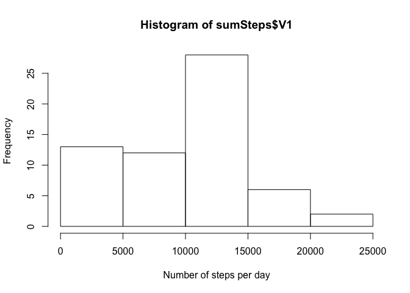
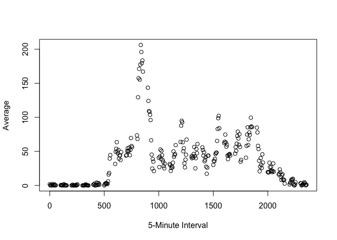
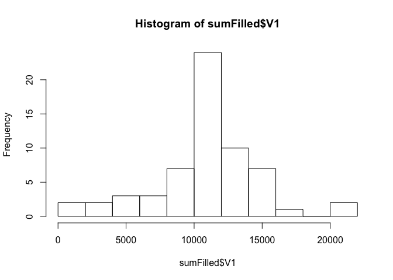
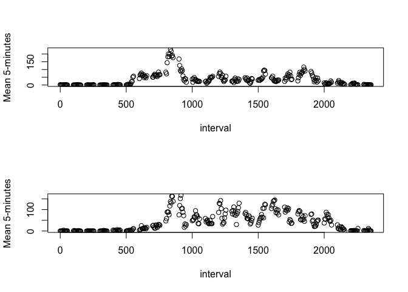

# Reproducible Research: Peer Assessment 1


## Loading and preprocessing the data
Firstly the file **activity.zip** is unziped then the   
**activity.csv** file is loaded to R as a data.table.


```r
  library(data.table)
  unzip("activity.zip");
  data <- data.table(read.csv("activity.csv"));
```
##  What is mean total number of steps taken per day?
The following histogram shows the histogram of the number of  
steps taken each day.


```r
# Sum steps by day
sumSteps <- data[, sum(steps, na.rm = TRUE), by = date];
# Display the result in a histogram
hist(sumSteps$V1, xlab = "Number of steps per day");
```

 

The following code shows the mean and median of the total number of steps taken per day.  


```r
  sumSteps[ , mean(V1, na.rm = TRUE)]
```

```
## [1] 9354.23
```

```r
  sumSteps[ , median(V1, na.rm = TRUE)]
```

```
## [1] 10395
```

## What is the average daily activity pattern?

The folowing plot show the 5-minute interval average 

```r
averageDaily <- data[ , mean(steps, na.rm = TRUE), by = interval];
plot(x = averageDaily$interval, y = averageDaily$V1, xlab = "5-Minute Interval", 
     ylab = "Average");
```

 

The interval which has the maximum average is: 

```r
averageDaily[which.max(V1), ]
```

```
##    interval       V1
## 1:      835 206.1698
```

### Filling missing values

It can be seen that only the variable step has missing values and it has 2304 missing values.  

```r
  summary(data)
```

```
##      steps                date          interval     
##  Min.   :  0.00   2012-10-01:  288   Min.   :   0.0  
##  1st Qu.:  0.00   2012-10-02:  288   1st Qu.: 588.8  
##  Median :  0.00   2012-10-03:  288   Median :1177.5  
##  Mean   : 37.38   2012-10-04:  288   Mean   :1177.5  
##  3rd Qu.: 12.00   2012-10-05:  288   3rd Qu.:1766.2  
##  Max.   :806.00   2012-10-06:  288   Max.   :2355.0  
##  NA's   :2304     (Other)   :15840
```

The following code fill missing value by the 5-minute interval mean


```r
  fill_missing <- function(step, inter) {
    ifelse(!is.na(step), result <- (step), 
           result <- averageDaily[averageDaily[ ,interval == inter]]$V1)
    result;
  }
  filledData <- data;
  filledData$steps <- mapply(fill_missing, filledData$steps, filledData$interval);
```

The following histogram shows the distrubition of the number of steps with missing values filled.


```r
  sumFilled <- filledData[ , sum(steps), by = date];
  hist(sumFilled$V1, breaks = 10);
```

 

The following code computes the mean and median of the data with missing values filled.

```r
  sumFilled[ , mean(V1)]
```

```
## [1] 10766.19
```

```r
  sumFilled[ , median(V1)]
```

```
## [1] 10766.19
```

The mean and median values are higher. 

## Are there differences in activity patterns between weekdays and weekends?


```r
  convert <- function(day) {
    day <- weekdays(day);
    ifelse(day %in% c("Monday", "Tuesday", "Wednesday", "Thursday", "Friday"),
           result <- "weekday",
           result <- "weekend");
    
    result
  }
  filledData$date <- as.Date(filledData$date);
  filledData[ , day := sapply(filledData$date, convert)];
```

```
##            steps       date interval     day
##     1: 1.7169811 2012-10-01        0 weekday
##     2: 0.3396226 2012-10-01        5 weekday
##     3: 0.1320755 2012-10-01       10 weekday
##     4: 0.1509434 2012-10-01       15 weekday
##     5: 0.0754717 2012-10-01       20 weekday
##    ---                                      
## 17564: 4.6981132 2012-11-30     2335 weekday
## 17565: 3.3018868 2012-11-30     2340 weekday
## 17566: 0.6415094 2012-11-30     2345 weekday
## 17567: 0.2264151 2012-11-30     2350 weekday
## 17568: 1.0754717 2012-11-30     2355 weekday
```

```r
  meanDay <- filledData[ , mean(steps), by = c("interval", "day")];
  meanWeekday <- meanDay[meanDay[ , day == "weekday"]]
  meanWeekend <- meanDay[meanDay[ , day == "weekend"]]

  par(mfrow = c(2,1));
  plot(x = meanWeekday$interval, y = meanWeekday$V1, xlab = "interval", ylab = "Mean 5-minutes");
  plot(x = meanWeekend$interval, y = meanWeekend$V1, xlab = "interval", ylab = "Mean 5-minutes"); 
```
<br>


There exists a difference between week days and weekend days 
